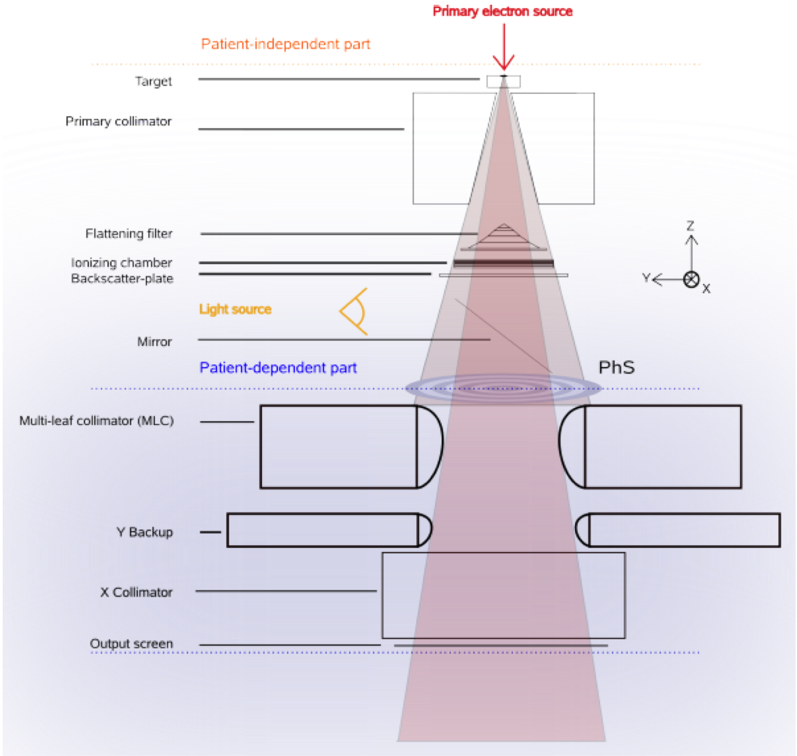

# Exercise 4

The example 4 illustrates the simulation of a linac head. We first show a full simulation, then split it into two parts. The first part aims at obtaining a phase-space (PhS) from electron source to a plane just before the MLC. The second part makes use of this PhS as a source.

### Step 1

Go into folder ```linac``` and run the simulations ```Gate mac/main.mac```

This simulation describe the irradiation of a waterbox from the linac head from the electron source. Look a the geometry and describe what is simulated. Explain the source. Explain the physical processes that occur. Investigate the time needed to obtain a dose distribution in the waterbox with a correct statistical uncertainty.


Figure from [[Grevillot2011]](https://www.ncbi.nlm.nih.gov/pubmed/21791731).

### Step 2

Now run the simulation ```Gate mac/main-write-PhS.mac```

Look a the geometry and describe what is simulated. Explain the source. Analyse the PhS with root: once the simulation is completed, type ```root``` to enter the root mode. Then, type ```TBrowser t``` to obtain a windows that will allow you to load the PhS. Explain what is the content of this PhS. Comment and look at the variance reduction technique in the macro file : what is the splitting ? Why ? Look at the options for generating a PhS, comment them. To exit root, type ```.q```.


### Step 3

Run the simulation ```Gate mac/main-read-PhS.mac```.

This simulation uses the PhS as input, describe it. Compare the time needed to obtain a correct statistical uncertainty in the waterbox. You can use the phase-space in the folder ```results.MD6k/``` that was computed with more particles.
