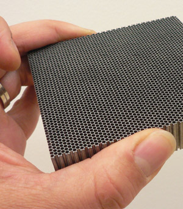

# Exercice6 - SPECT

In the folder [spect](https://gitlab.in2p3.fr/david.sarrut/gate-exercices/tree/master/spect/mac) you will find a simplified simulation of a SPECT acquisition. Warning: this simulation need a very long computation time to reach acceptable statistic. Some variance reduction techniques exist, but are not shown here.

This is a rather complex simulation. Try to understand every elements \(in particular in spect\_head, spect\_collimator, spect\_digitizer\).

You may change the phantom \(just a waterbox here\) by a ct image for example. You may change the source to observe the impact.

A collimator: 

