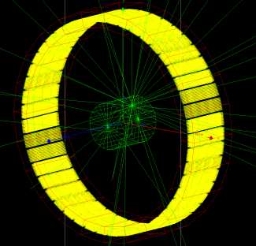

# Exercice7 - PET

The folder `pet` contains the description of a simple PET system. 

The camera is composed of a 46x4 crystal block as a ring. Each crystal block contains 12x12 crystal \(4.5mm\). The phantom is a water cylinder. The source is in the cylinder, not centered \(offset 5 and 7 cm\).

Try to understand every element and perform some modifications to analyse output results.The analysis of output may be perform via the python notebook: [http://localhost:8889/notebooks/PET%20analysis.ipynb\#PET-simulation-analysis](http://localhost:8889/notebooks/PET%20analysis.ipynb#PET-simulation-analysis)

