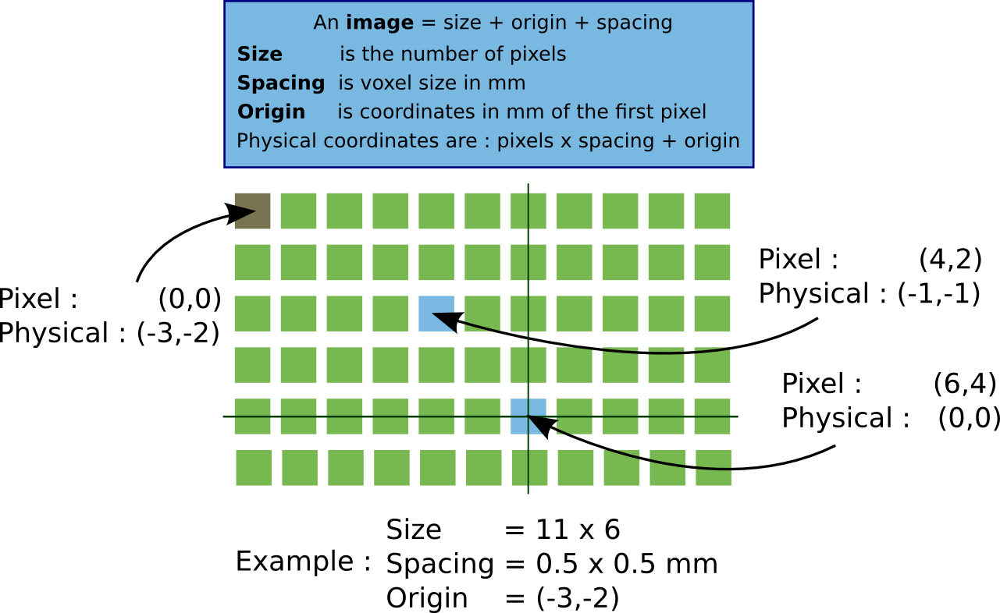
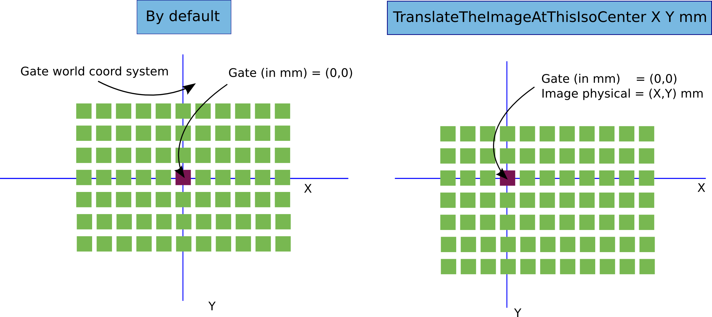

# Exercise2 - 3D

Change for 3D dose distribution as described in `ex2.mac`. Describe all the outputs. Analyse the 3D distribution \(with `vv`\) and the 3D uncertainty. Analyse the `stat-pat.txt` file \(with gnuplot file `plot-ex2.gp`\). Change the parameters of the 3D dose actor. Comments.

Example of command for vv : `vv data/patient-2mm.mhd --fusion output/3d-pat-Edep.mhd` to superimpose the computed edep to the CT image.

In addition to the 3D "edep" map, depth and transverse profiles are output in txt files `depth-pat.txt` and `profile-pat.txt`. You may want to write a python script to plot those curves.

## Notes on coordinates systems

An image, in particular a medical image, is always associated with a coordinate systems.



Important notions are : **size**, **origin**, **spacing** and **orientation** \(matrix of orientation, not indicated in the figure\).

Gate/G4 manages its own coordinate system \(world center\). The origin of the image is **not** used to position the image. The position is, like all other volumes, according to the geometrical center of the image.



However, two additional features are available within Gate:

* the macro `TranslateTheImageAtThisIsoCenter` allows to translate an image according to a coordinate given in the image coordinate system \(thus taking the image origin into account\). This is very convenient: just open the image with `vv`for example, click on a pixel and note its physical coordinates \(in mm\). Report this value in GATE: the image will be located in the world such as this pixel is at the center of the world \(0,0,0\). 

```text
/gate/patient/geometry/TranslateTheImageAtThisIsoCenter 109.7 99.3 146.2 mm
```

* when an actor, in particular a `DoseActor` is attached to an image, the resulting dose images will be written on disk by taking into account the origin of the image. Hence, it will be easy to overlay the dose on the image. 

## Analysis

Use the python notebook to display and analyse the 3D distribution map: [http://localhost:8889/notebooks/exercice%20dose%20map%20analysis.ipynb](http://localhost:8889/notebooks/exercice%20dose%20map%20analysis.ipynb)

