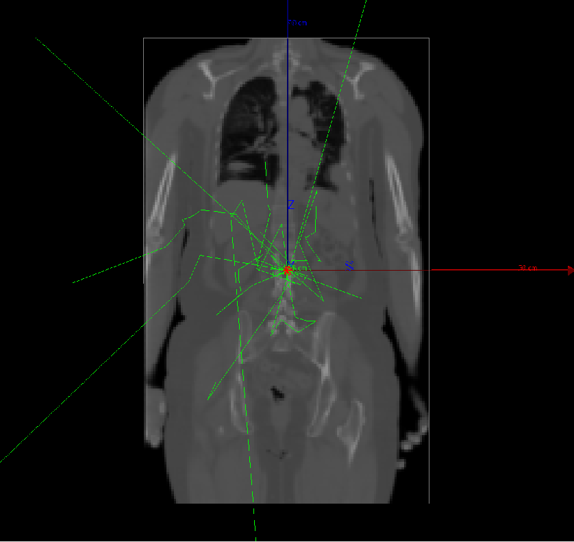

# Exercise5 - TRT

Targeted radionuclide therapy \(TRT\) delivers radiation to lesions by administration of radiolabeled molecular agents designed to specifically concentrate into targets. We want now to create a simulation of such a treatment \(internal radiation therapy\). Macros will be in the folder `internal-rt`.

## Step 1

To start, we first study some radionuclides. Create from scratch a simple simulation that allow you to get the energy spectrum of the e- emitted by a source of Yttrium-90 in a vacuum. Energy spectrum may be recorded with a `EnergySpectrumActor` or a `PhaseSpaceActor`. Plot the energy spectrum.

In GATE, a source of a radionuclide is defined with some macro like:

```text
    /gate/source/addSource Yttrium
    /gate/source/Yttrium/gps/particle ion
    /gate/source/Yttrium/gps/ion 39 90 0 0
    /gate/source/Yttrium/gps/type Volume
    /gate/source/Yttrium/gps/shape Sphere
    /gate/source/Yttrium/gps/radius 1.5 mm
    /gate/source/Yttrium/gps/angtype iso
    /gate/source/Yttrium/gps/centre 0. 0. 0. mm
    /gate/source/Yttrium/gps/energy 0 MeV
```

Do not forget to add the radioactive decay process:

```text
    /gate/physics/addProcess RadioactiveDecay
    /gate/physics/addPhysicsList emstandard_opt3
```

Use a [Filter](http://wiki.opengatecollaboration.org/index.php/Users_Guide:Tools_to_Interact_with_the_Simulation_:_Actors#Filters) to record separately the energy spectrums for e- and gamma.

Analyze the emitted e- and gamma from other radionuclides used for treatment, for example Lutetium-177 or Iode-131. You may also consider radionuclides used for imaging: Indium-111 \(spect\), Gallium-68 \(pet\) or Fluor-18 \(pet\).

Information can be found on [http://www.nucleide.org/DDEP\_WG/DDEPdata.htm](http://www.nucleide.org/DDEP_WG/DDEPdata.htm).

## Step 2

Modify the previous simulations in order to plot the depth dose curve of the radionuclides in water. You may have to change the direction of emission of the source along a defined direction. Consider a depth resolution of for example, 0.2 mm.

What are the differences in absorbed dose according to the radionuclides ?

## Step 3

We will now learn to use a "voxelized source". This is an emitting source of particles described as a spatial distribution with a matrix of pixel intensity. Several SPECT images have been calibrated and merged together to produce a time-integrated activity emission map \(TIA\) associated with a patient CT. Consider the simulation that uses this TIA as a voxelized source, see macros [main.mac](https://gitlab.in2p3.fr/david.sarrut/gate-exercices/blob/master/internal-rt/mac/main.mac) and [source-vox.mac](https://gitlab.in2p3.fr/david.sarrut/gate-exercices/blob/master/internal-rt/mac/source-vox.mac) in the folder `internal-rt`. The pixels in the TIA image are expressed in MBq.h.

Perform a simulation, analyze the results.

## Step 4

Change the voxelized source to a simple point source in the middle of the patient. Then, change the radionuclide, for example by using Lutetium-177 or Iode-131 or any radionuclides you like in [http://www.nucleide.org/DDEP\_WG/DDEPdata.htm](http://www.nucleide.org/DDEP_WG/DDEPdata.htm). You may look at the [source-gps.mac](https://gitlab.in2p3.fr/david.sarrut/gate-exercices/blob/master/internal-rt/mac/source-gps.mac) file.

What are the differences in absorbed dose according to the radionuclides ?

## Step 5 \(optional\)

The folder `brachytherapy` contains macros for performing simplified brachytherapy simulations.



